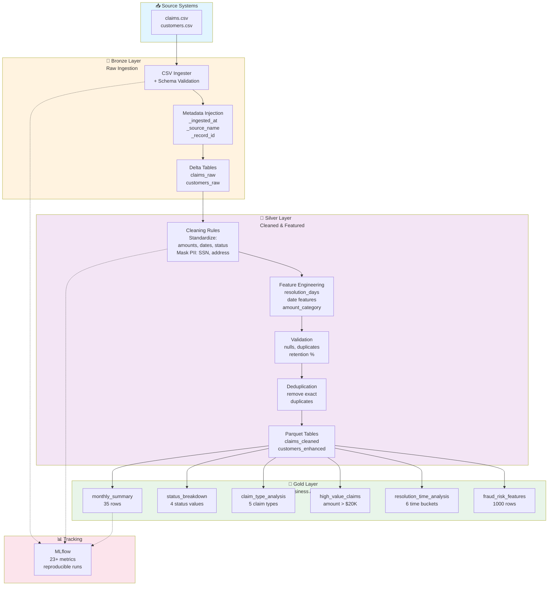
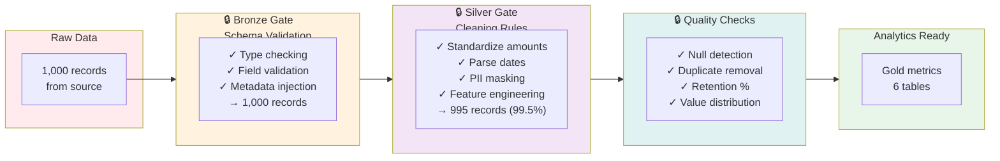
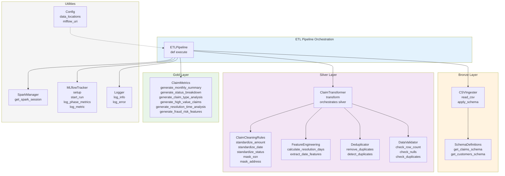
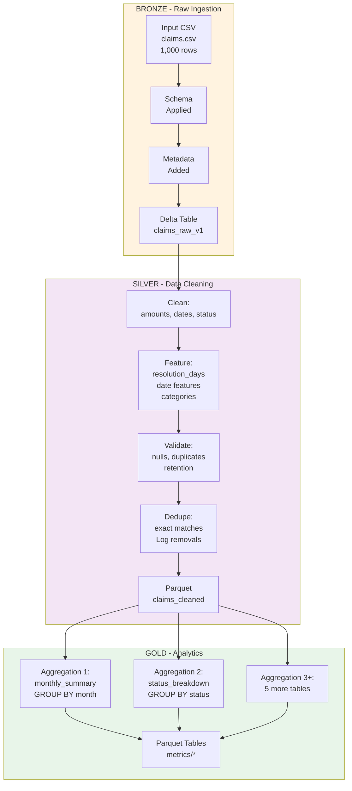
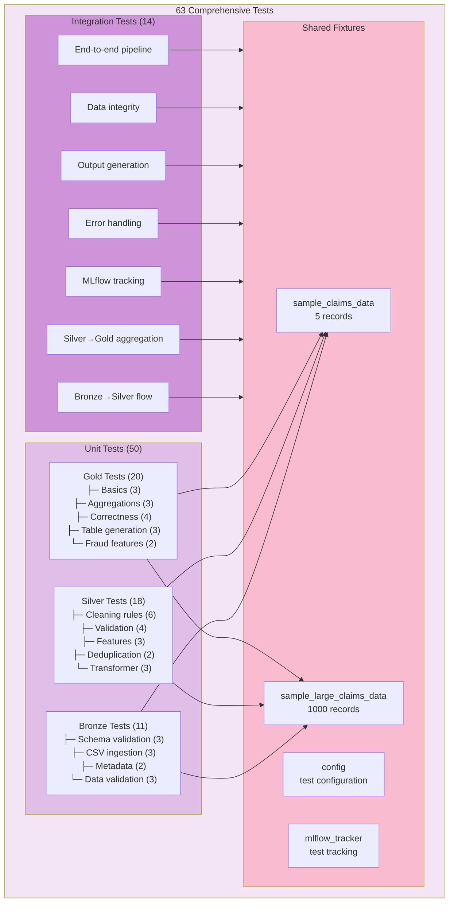
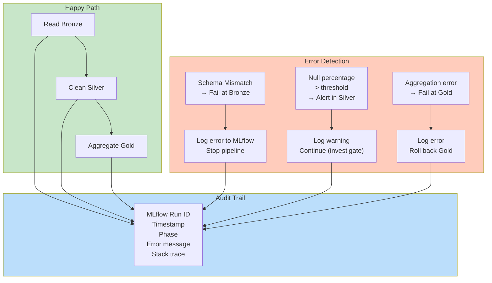
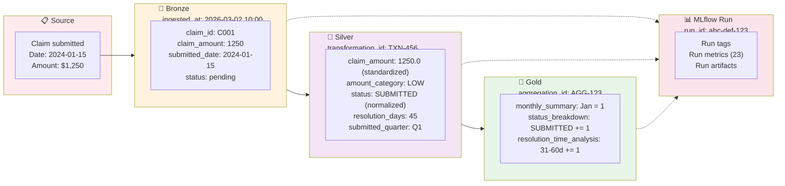
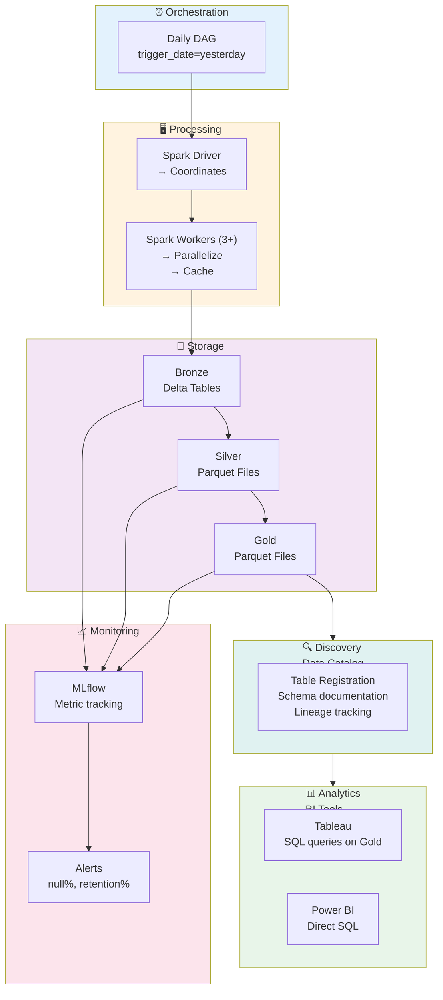
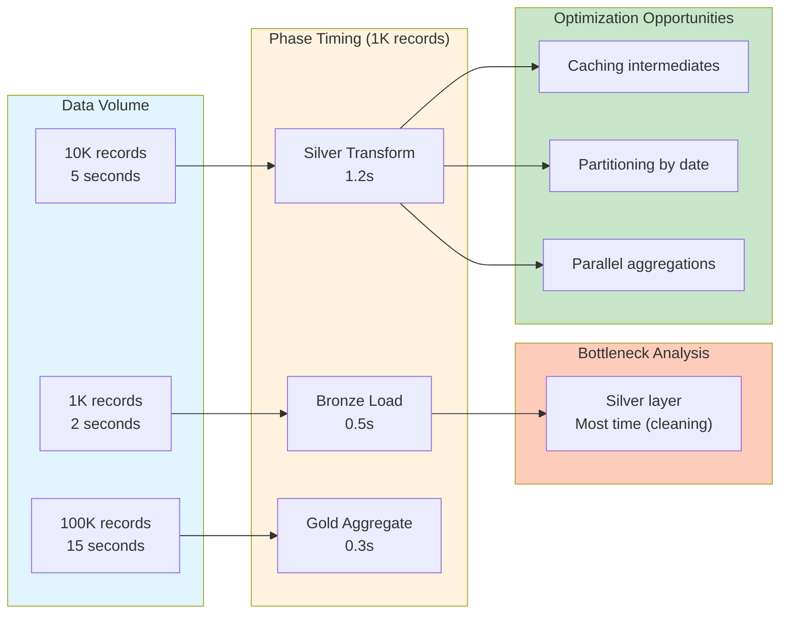

# Architecture Diagrams

## 1. Medallion Architecture Overview

---

## 2. Data Quality Gates

---

## 3. Code Structure & Dependencies

---

## 4. Data Transformation Pipeline

---

## 5. Test Structure

---

## 6. MLflow Experiment Tracking

```mermaid
graph LR
    subgraph Run["MLflow Run"]
        RID["Run ID<br/>uuid"]
        Tags["Tags<br/>phase: silver<br/>environment: test"]
        Params["Parameters<br/>cleaning_rules_v1.2<br/>schema_v3"]
    end
    
    subgraph Metrics["Metrics Logged"]
        M1["Bronze Phase<br/>├─ rows_ingested: 1000<br/>├─ nulls_detected: 12<br/>└─ duration_sec: 0.5"]
        M2["Silver Phase<br/>├─ records_validated: 1000<br/>├─ duplicates_removed: 5<br/>├─ features_created: 4<br/>└─ duration_sec: 1.2"]
        M3["Gold Phase<br/>├─ monthly_rows: 35<br/>├─ status_rows: 4<br/>└─ duration_sec: 0.8"]
    end
    
    subgraph Artifacts["Artifacts"]
        A1["config.yaml<br/>transformation_log.txt<br/>quality_report.json"]
    end
    
    subgraph Comparison["Historical Comparison"]
        H["Run 2026-03-02: 23 metrics<br/>Run 2026-03-01: 23 metrics<br/>Δ duplicates: +3 (alert!)"]
    end
    
    Run --> Metrics
    Metrics --> Artifacts
    Artifacts --> Comparison
    
    style Run fill:#fce4ec
    style Metrics fill:#f8bbd0
    style Artifacts fill:#f48fb1
    style Comparison fill:#ec407a
```

---

## 7. Error Handling & Resilience

---

## 8. Data Lineage (Claim Journey)

---

## 9. Deployment Architecture (Future)

---

## 10. Performance Characteristics

---

These diagrams illustrate:
1. **Level 1:** High-level medallion architecture
2. **Level 2:** Quality gates ensuring data integrity
3. **Level 3:** Code structure and dependencies
4. **Level 4:** Data transformation flow
5. **Level 5:** Test coverage strategy
6. **Level 6:** MLflow tracking for reproducibility
7. **Level 7:** Error handling and resilience
8. **Level 8:** Complete data lineage journey
9. **Level 9:** Future deployment architecture
10. **Level 10:** Performance characteristics

**Documentation note:** Walk through diagrams 1–5 in order, use 6–8 to discuss observability, and reference 9–10 when asked about scaling/production.
